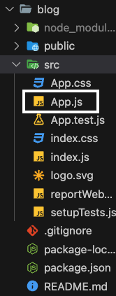

# React 기초

---


## 리액트 프로젝트 생성하는 방법


### 맥OS homebrew로 Node.JS 설치

```bash
$ brew install node
```

#### 이러면 npm까지 같이 설치됨


### 프로젝트 생성하려는 디렉토리로 이동해서

```bash
$ npx create-react-app ProjectName
```

#### 이러면 해당 디렉토리에 이름이 `ProjectName`인 폴더 생성됨




#### 만들어진 폴더안의 src 폴더 내의 `App.js`가 메인 파일임

### 프로젝트 디렉토리로 들어가서  `$ npm start` 하면 브라우저 열리고 만들어진 웹페이지 볼 수 있음


## 리액트에서 사용하는 JSX 문법


### JSX: JS파일에서 사용하는 HTML 비슷한거

```react
<div className="nav"></div>
```


#### 1. JSX에서는 `class` 대신 `className`을 써서 클래스 적용함

```react
import `css파일 경로`;
```

### css파일 import하려면 `App.js` 파일 상단에 import 문 넣어주면 됨


### 2. 변수를 넣을 때 `{}` 중괄호 사용함  (데이터 바인딩)

```react
function App() {
  let blogTitle = "New Blog";	//변수 생성
  return (
    <div className="App">
      <div class="nav">
        <h4>{blogTitle}</h4>   
      </div>
    </div>
  );
}
```

#### 위처럼 blogTitle이라는 변수를 만들고 그 변수를 h4의 innerText로 넣을 수 있음

#### innerText 말고도 id나 className도 변경할 수 있음


### 3. style 넣을 때 `style={}` 써서 스타일 적용함

```react
<div className="App">
	<div class="nav">
		<h4 style={ {color : 'red'} }>{blogTitle}</h4>     
  </div>
</div>
```

#### `style={ { style : 'value'} }` 처럼 중괄호를 사용하고 스타일 속성은 **camelCase** 로 작성해야함<br>js에서 `-`기호는 빼기라서

